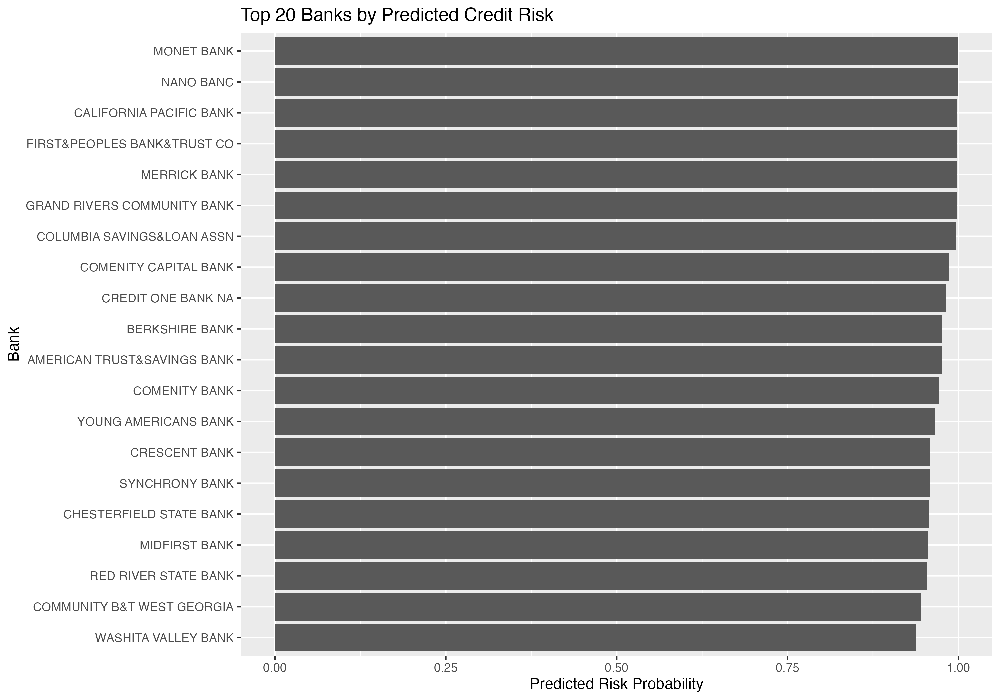
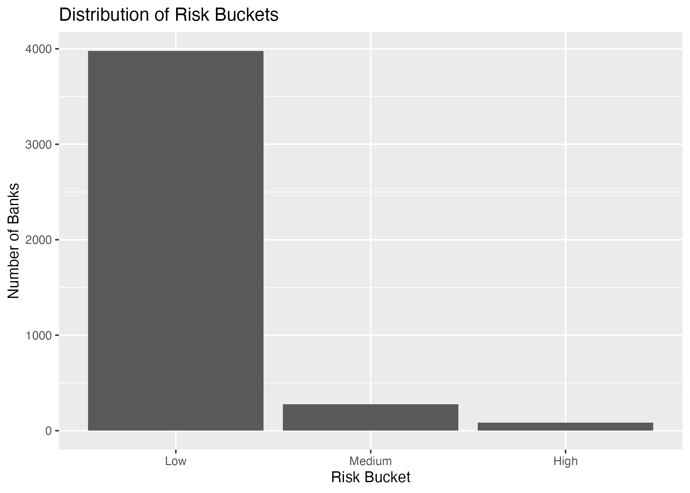

# Credit Risk Scoring System in R

This project builds a **credit risk scoring model** using publicly available U.S. banking data from the FDIC.

It demonstrates an end-to-end data science workflow:
- data ingestion
- feature engineering
- modeling
- evaluation
- business output (risk watchlist)
- reporting and visualization

---

## Project Overview

The goal is to identify banks with **elevated credit risk** based on financial ratios.

Because the dataset currently contains a **single reporting quarter**, the project is framed as:

> **Cross-sectional credit risk classification**, not time-series forecasting

The final output is a **ranked watchlist of higher-risk banks**, similar to real-world risk monitoring workflows.

---

## Data Sources

- FDIC BankFind / Call Report data (bank-level financials)
- Optional macroeconomic data from FRED

---

## Key Features

The model uses financial indicators such as:

- Noncurrent loan ratio (`npa_ratio`)
- Capital ratio (`capital_ratio`)
- Return on assets (`roa`)
- Equity-to-assets ratio
- Loans-to-assets
- Deposits-to-assets

---

## Target Definition

A bank is classified as **high risk** if:

> Its net charge-off ratio falls in the **top 25%** of all banks

---

## Models Implemented

### 1. Logistic Regression (Baseline)
- Interpretable model
- Establishes relationship between financial ratios and risk

### 2. Random Forest
- Captures nonlinear relationships
- Provides variable importance

### 3. XGBoost (Optional Advanced Model)
- Gradient boosting model
- Higher predictive power

---

## Model Evaluation

The models are evaluated using:

- Accuracy
- AUC (Area Under ROC Curve)
- Confusion matrix
- Repeated holdout validation (30 iterations)

---

## Outputs

### Watchlist

Ranked list of banks by predicted risk:

outputs/watchlists/watchlist.csv  
outputs/watchlists/watchlist_top20.csv

### Charts

Generated visualizations:

- Top 20 risky banks
- Risk distribution
- ROA vs risk
- NPA ratio vs risk
- Model performance charts

outputs/figures/

### Report

Final report generated using Quarto:

reports/credit_risk_report.html

---

## Project Structure

R/  
  04_clean_bank_data.R  
  05_build_target.R  
  06_feature_engineering.R  
  07_eda.R  
  08_model_logistic.R  
  09_model_tree.R  
  10_model_xgboost.R  
  11_backtest.R  
  12_score_watchlist.R  
  13_make_charts.R  

data_raw/  
data_processed/  
outputs/  
models/  
reports/  
app/  

---

## How to Run

Run scripts in order:

source("R/04_clean_bank_data.R")  
source("R/05_build_target.R")  
source("R/06_feature_engineering.R")  
source("R/07_eda.R")  
source("R/08_model_logistic.R")  
source("R/09_model_tree.R")  
source("R/10_model_xgboost.R")   # optional  
source("R/11_backtest.R")  
source("R/12_score_watchlist.R")  
source("R/13_make_charts.R")  

Generate report:

quarto::quarto_render("reports/credit_risk_report.qmd")

---

## Optional: Shiny App

A basic interactive dashboard is available:

shiny::runApp("app")

This allows:
- filtering banks by risk
- exploring model outputs interactively

---

## Key Takeaways

This project demonstrates:

- Working with real financial data (FDIC)
- Feature engineering for credit risk
- Building and comparing multiple models
- Avoiding target leakage
- Producing business-ready outputs (watchlist)
- Communicating results via charts and reports

---

## Limitations

- Single-quarter dataset (no time-series prediction)
- Some variables are ratio-based proxies
- No macro stress testing included

---

## Future Improvements

- Multi-quarter dataset for true predictive modeling
- Time-based backtesting
- Scenario analysis with macro variables
- Enhanced Shiny dashboard

---

## Notes on FDIC Schema Mapping

This project includes a **real FFIEC Call Report schema mapping** for key financial fields.

See:

SCHEMA_NOTES.md

for details on:

- field mapping
- noncurrent loan handling
- net charge-off derivation

---

## Sample Output

Add screenshots after generating charts:

  

